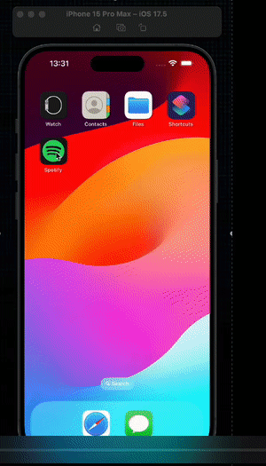

# ContextAPI Spotify Clone

A React Native project built with React Native CLI, featuring key dependencies that support navigation, media playback, and more.

## Features

- **@react-native-async-storage/async-storage**: Enables local data storage to save user settings, session tokens, and other essential information on the device, ensuring a seamless user experience even when offline.

- **@react-navigation/bottom-tabs**: Manages bottom tab navigation, making it easy for users to switch between key sections like Home, Search, Library, and Profile—just like in the real Spotify app.

- **@react-navigation/native** and **@react-navigation/native-stack**: These dependencies provide core navigation capabilities, allowing smooth transitions between different screens (e.g., from the Home feed to the Now Playing screen).

- **axios**: This HTTP client fetches data from the Spotify API, including playlists, song details, and album art, enabling a dynamic and up-to-date user experience.

- **react-native-app-auth**: Handles OAuth-based user authentication to connect users with their Spotify accounts, supporting login via Spotify’s secure API.

- **react-native-fast-image**: Optimizes image loading and caching, ensuring album covers, artist images, and thumbnails load quickly and smoothly for a visually rich user interface.

- **react-native-linear-gradient**: Adds gradient effects, enhancing the visual appeal of elements like the Now Playing screen background.

- **react-native-modal**: Displays modal views within the app, ideal for features like showing song options or adding to playlists.

- **react-native-reanimated**: Provides fluid animations to create a polished, high-quality user experience, such as the sliding transition on the Now Playing screen.

- **react-native-screens**: Optimizes navigation performance by using native view management for screens, making navigation feel smooth and responsive.

- **react-native-sound**: Handles audio playback within the app, providing playback controls and streaming capabilities.

- **react-native-track-player**: Adds advanced audio playback controls, enabling users to play, pause, skip, and scrub through tracks, just like in the real Spotify.

- **react-native-vector-icons**: Provides a library of icons to create familiar UI elements, such as the play/pause button, navigation icons, and settings.

These dependencies collectively support the Spotify clone's core functionality, navigation, media playback, and real-time UI updates, offering a rich and seamless music streaming experience.

## Preview

